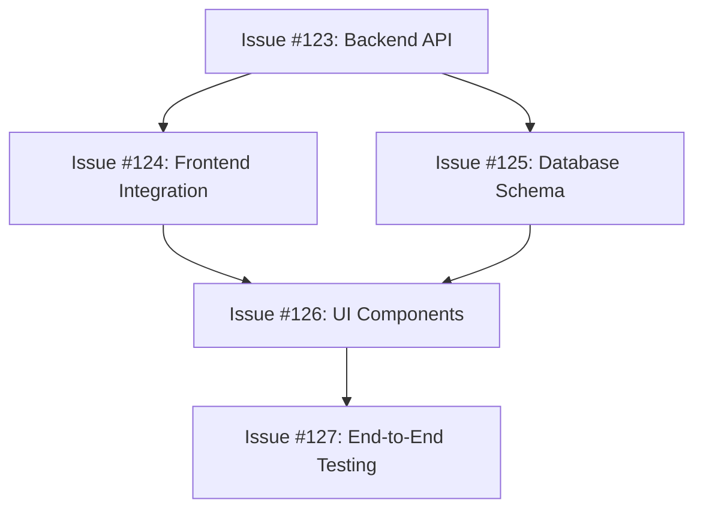

# Feature Progress Tracking Template

Template for tracking feature completion progress by aggregating issue statuses. Enables real-time progress queries and PM agent decision making.

## Progress File Format

### File Location
`project-breakdown/features/{feature-name}/progress.md`

### Template Structure

```markdown
# Feature Progress: {Feature Name}

**Feature**: [{feature-name}](feature-summary.md)
**Overall Progress**: {percentage}% Complete
**Status**: {Planning | In Progress | Ready for Review | Completed}
**Last Updated**: {timestamp}
**Next Priority**: {what should be worked on next}

## Progress Summary

### Completion Overview
- **Total Issues**: {total-count}
- **Completed**: {completed-count} ({percentage}%)
- **In Progress**: {in-progress-count} 
- **Ready to Start**: {ready-count}
- **Blocked**: {blocked-count}

### Issue Breakdown by Status

#### ✅ Completed Issues ({completed-count}/{total-count})
- [#{number}: {title}]({github-url}) | [Local File](issues/{file-name}.md) 
  - **Completed**: {date} | **Engineer**: {agent-name}
  - **Implementation**: {brief summary of what was built}

#### 🔄 In Progress Issues ({in-progress-count})
- [#{number}: {title}]({github-url}) | [Local File](issues/{file-name}.md)
  - **Started**: {date} | **Engineer**: {agent-name} 
  - **Progress**: {brief status update}
  - **ETA**: {estimated completion}

#### 📋 Ready to Start ({ready-count})
- [#{number}: {title}]({github-url}) | [Local File](issues/{file-name}.md)
  - **Dependencies**: {dependency status - all met}
  - **Priority**: {High | Medium | Low}
  - **Effort**: {Small | Medium | Large}

#### ⏸️ Blocked Issues ({blocked-count})
- [#{number}: {title}]({github-url}) | [Local File](issues/{file-name}.md)
  - **Blocked by**: Issue #{number} | {external dependency}
  - **Impact**: {how this affects overall progress}

## Dependency Analysis

### Critical Path
**Issues that block the most other work**:
1. Issue #{number}: {title} - Blocks {count} other issues
2. Issue #{number}: {title} - Blocks {count} other issues

### Ready for Parallel Execution
**Issues that can be worked on simultaneously**:
- Issue #{number}: {title} (no dependencies)
- Issue #{number}: {title} (dependencies met)
- Issue #{number}: {title} (independent component)

### Dependency Chain


## Engineering Allocation Recommendations

### Current Resource Allocation
- **Engineer 1**: Issue #{number} - {progress status}
- **Engineer 2**: Issue #{number} - {progress status}
- **Engineer 3**: Issue #{number} - {progress status}

### Optimal Next Assignments
**For PM Agent Decision Making**:

1. **High Priority**: Issue #{number} - {rationale for urgency}
2. **Medium Priority**: Issue #{number} - {rationale}
3. **Low Priority**: Issue #{number} - {rationale}

### Parallel Work Opportunities
**Issues that can be assigned to multiple engineers**:
- Issues #{numbers} can work in parallel (independent components)
- Issues #{numbers} waiting for Issue #{number} completion

## Progress Milestones

### Completed Milestones
- **{milestone-name}** ({date}) - {what was achieved}
- **{milestone-name}** ({date}) - {what was achieved}

### Upcoming Milestones  
- **{milestone-name}** (Target: {date}) - {what will be achieved}
  - **Required Issues**: #{numbers}
  - **Current Status**: {on track | at risk | behind}

### Feature Completion Criteria
- [ ] All core functionality implemented (Issues #{numbers})
- [ ] Integration testing complete (Issue #{number})
- [ ] Documentation updated (Issue #{number})
- [ ] Performance validated (Issue #{number})
- [ ] User acceptance criteria met

## Quality Metrics

### Code Quality
- **Test Coverage**: {percentage}% (Target: {target}%)
- **Code Review Status**: {completed/total} reviews done
- **Technical Debt**: {none | low | medium | high}

### Performance Indicators
- **Implementation Velocity**: {issues/week} (trending {up/down/stable})
- **Blocker Resolution Time**: {average time to unblock}
- **Integration Success Rate**: {percentage of integrations working first time}

## Risk Assessment

### Current Risks
- **{risk-category}**: {description and impact}
- **{risk-category}**: {description and impact}

### Mitigation Strategies
- **{risk}** → **{mitigation approach}**
- **{risk}** → **{mitigation approach}**

## PM Agent Coordination Notes

### Decision Context for PM Agents
**When assigning new work, consider**:
- **Critical path items** take priority
- **Engineer expertise** should match issue complexity
- **Parallel opportunities** maximize throughput
- **Dependency chains** prevent downstream blocking

### Resource Optimization
- **Max 3 engineers** working simultaneously
- **Prefer independent issues** for parallel work
- **Front-load dependencies** to unblock downstream work
- **Reserve 1 engineer slot** for urgent bug fixes

### Escalation Triggers
**When to alert human oversight**:
- Feature progress drops below {threshold}% of target
- Critical path issues blocked > {timeframe}
- Engineering resource conflicts arise
- External dependencies cause delays

## Status Query Interface

### Quick Status Queries
**For agents answering "What's the status of {feature}?"**

**One-line summary**: {percentage}% complete, {in-progress-count} issues active, next priority: Issue #{number}

**Detailed summary**: 
- Progress: {completed}/{total} issues done ({percentage}%)
- Active work: {list of in-progress issues}
- Next up: {list of ready issues}
- Blockers: {list of blocked issues}
- ETA: {estimated feature completion date}

### Progress Trend
- **Last Week**: {previous-percentage}% → **Current**: {current-percentage}%
- **Velocity**: {issues completed per week}
- **Trend**: {accelerating | steady | slowing}

## Integration with Board Sync

### Automatic Updates
This progress file is automatically updated when:
- **Issue status changes** (via board sync)
- **New issues created** (via issue discovery)
- **Engineering work completed** (via agent coordination)
- **Dependencies resolved** (via dependency tracking)

### Manual Updates
Use `/feature-progress-update --feature {name}` to:
- Recalculate completion percentages
- Update dependency status
- Refresh milestone tracking
- Generate latest progress reports
```

## Progress Calculation Logic

### Completion Percentage Formula
```javascript
const calculateProgress = (issues) => {
  const weights = {
    'Small': 1,
    'Medium': 2, 
    'Large': 3
  };
  
  const totalWeight = issues.reduce((sum, issue) => 
    sum + weights[issue.effort], 0);
  
  const completedWeight = issues
    .filter(issue => issue.status === 'Done')
    .reduce((sum, issue) => sum + weights[issue.effort], 0);
  
  return Math.round((completedWeight / totalWeight) * 100);
};
```

### Status Aggregation Rules
- **Planning**: No issues in progress, some issues ready
- **In Progress**: At least one issue being worked on
- **Ready for Review**: All issues complete, feature integration pending
- **Completed**: All issues done and feature validated

## Usage Guidelines

### For PM Agents
1. **Read progress file** before assigning new work
2. **Check dependency status** to identify ready issues
3. **Consider critical path** when prioritizing assignments
4. **Update progress file** after status changes
5. **Monitor velocity** to predict completion dates

### For Status Queries
1. **Quick queries** use one-line summary format
2. **Detailed queries** include full breakdown
3. **Trend analysis** compares current vs. historical progress
4. **Risk assessment** highlights potential delays

### For Progress Updates
1. **Auto-update** on issue status changes
2. **Manual refresh** when dependencies change
3. **Milestone tracking** updates on significant progress
4. **Escalation alerts** when progress deviates from targets

## Success Metrics

### Feature-Level Success
- **Completion accuracy**: Progress estimates within {threshold}% of actual
- **Velocity consistency**: Week-over-week progress stays within {range}%
- **Dependency management**: Blockers resolved within {timeframe}

### Project-Level Success  
- **Cross-feature coordination**: Dependencies between features tracked
- **Resource optimization**: Engineer allocation maximizes parallel work
- **Predictability**: Feature completion dates accurate within {timeframe}

Begin by reading existing feature files to understand current progress state, then update the progress.md file with calculated completion percentages based on issue statuses.